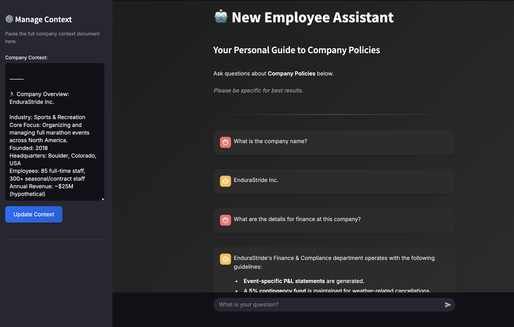

# 🤖 AI New Employee Assistant

[](https://www.python.org/)
[](https://fastapi.tiangolo.com/)

A full-stack web application leveraging AI to answer new employee questions based on provided company context. Built as a 3-day sprint project.

**Live Demo:** [https://new-employee-assistant.streamlit.app](https://new-employee-assistant.streamlit.app)



## Description

Onboarding new employees involves answering many common questions about company policies, tools, and culture. This project aims to automate and streamline this process by providing an AI-powered assistant that can answer these questions instantly based on a predefined context document.

This serves as a demonstration of building a full-stack AI application integrating a Large Language Model (LLM), backend API, database, and a simple frontend UI within a tight timeframe.

## Features

*   **Contextual Q&A:** Ask questions in natural language about company policies, tech setup, culture, etc.
*   **AI-Powered Answers:** Uses Google Gemini (`gemini-1.5-pro`) to generate answers based *only* on the provided internal context document.
*   **Simple Chat Interface:** Clean and easy-to-use UI built with Streamlit.
*   **Q&A Logging:** Questions and their corresponding AI answers are logged to a Supabase (PostgreSQL) database for potential review or future analysis.

## Tech Stack

*   **Frontend:** Streamlit (UI Framework), Python, Requests (HTTP Client)
*   **Backend:** FastAPI (API Framework), Python, Uvicorn (ASGI Server)
*   **AI:** Google Gemini API (`gemini-1.0-pro`) via `google-generativeai` library
*   **Database:** Supabase (Managed PostgreSQL) via `supabase-py` library
*   **Deployment:**
    *   Frontend: Streamlit Cloud
    *   Backend: Render
    *   Database: Supabase

## How It Works

1.  **User:** Interacts with the Streamlit frontend UI.
2.  **Frontend (Streamlit Cloud):** Captures the user's question and sends an HTTP POST request to the backend API.
3.  **Backend (Render - FastAPI):**
    *   Receives the question via the `/ask` endpoint.
    *   Constructs a prompt containing instructions, predefined company context, and the user's question.
    *   Sends the prompt to the Google Gemini API (using API key stored securely as an environment variable on Render).
    *   Receives the generated answer from Gemini.
    *   Logs the question and answer to the Supabase database (using DB URL/Key stored securely as environment variables on Render).
    *   Returns the answer as a JSON response to the frontend.
4.  **Frontend (Streamlit Cloud):** Receives the JSON response and displays the AI's answer in the chat interface.

## Setup & Run Locally (Optional)

1.  **Prerequisites:**
    *   Python 3.10+
    *   Git
    *   Accounts for: Google AI Studio (for Gemini API Key), Supabase (for DB URL/Key), Render (optional, for deployment reference), Streamlit Cloud (optional, for deployment reference).

2.  **Clone Repository:**
    ```bash
    git clone https://github.com/SebastianMoseres/onboarding-assistant.git
    cd onboarding-assistant
    ```

3.  **Create `.env` File:**
    *   In the root `onboarding-assistant` directory, create a file named `.env`.
    *   Add your secret keys (replace placeholders with your actual keys):
        ```plaintext
        # .env file
        SUPABASE_URL=your_supabase_project_url_here
        SUPABASE_KEY=your_supabase_service_role_key_here
        GOOGLE_API_KEY=your_google_api_key_here
        ```
    *   **Note:** This file is listed in `.gitignore` and should NOT be committed.

4.  **Setup Backend:**
    ```bash
    cd backend
    python -m venv .venv
    source .venv/bin/activate  # Or .\venv\Scripts\activate on Windows
    pip install -r requirements.txt
    # Leave venv active and run the server (in this terminal):
    uvicorn main:app --reload --port 8000
    ```

5.  **Setup Frontend (in a *new* terminal):**
    ```bash
    cd ../frontend # Navigate back to root, then into frontend
    python -m venv .venv
    source .venv/bin/activate  # Or .\venv\Scripts\activate on Windows
    pip install -r requirements.txt
    # Leave venv active and run the app (in this second terminal):
    streamlit run app.py
    ```

6.  Access the app locally, usually at `http://localhost:8501`.

## Future Improvements

*   **Load Context from Files/DB:** Instead of hardcoding `COMPANY_CONTEXT`, load it from text files, Markdown, or a dedicated database table.
*   **Vector Database for Context Retrieval:** For larger documents, implement a vector database (like Supabase Vector, Pinecone) and retrieval-augmented generation (RAG) to find the *most relevant* context chunks dynamically before sending to the LLM.
*   **User Authentication:** Add user logins (e.g., using Supabase Auth, Clerk) if different users need different contexts or history.
*   **More Sophisticated Error Handling:** Improve user feedback on errors.
*   **Streaming Responses:** Show the AI answer token-by-token as it's generated for better perceived performance.

---

*Project developed by Sebastian Moseres.*
